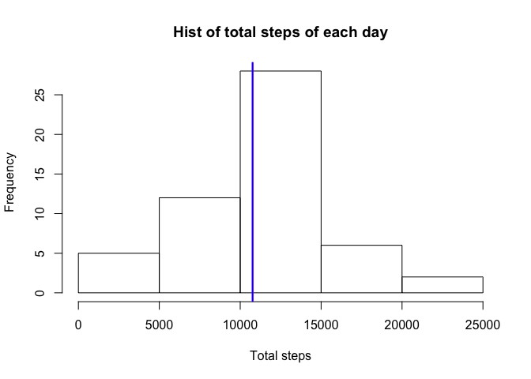
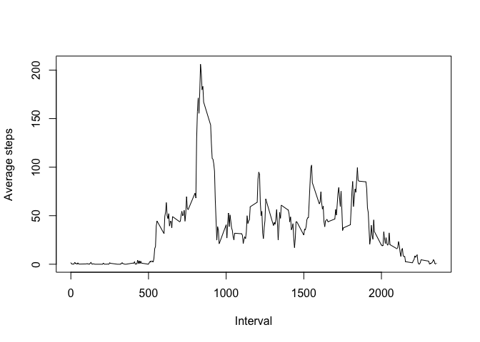
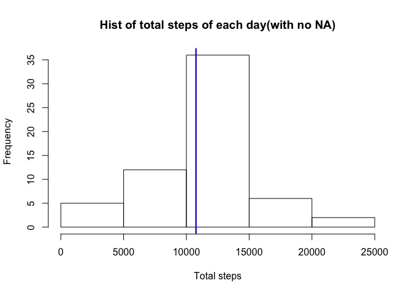

# Reproducible Research: Peer Assessment 1


## Loading and preprocessing the data

```r
setwd("~/Desktop/Coursera/Reproducible Research/week 2/Project/RepData_PeerAssessment1/")
activity <- read.csv("./activity.csv")
```


## What is mean total number of steps taken per day?
First we can plot the total number of steps taken each day.
By using aggregate function we got a new dataset which contains the date and corresponding total steps.

```r
aggsum <- aggregate(steps~date, activity, sum)
```

Then use histogram to show the distribution of total steps each day.

```r
hist(aggsum$steps,main = "Hist of total steps of each day",xlab = "Total steps")
abline(v = mean(aggsum$steps),col = "magenta",lwd = 2)
abline(v = median(aggsum$steps), col = "blue",lwd = 2)
```

<!-- -->

Mean and median of the total number of steps taken per day

```r
mean(aggsum$steps)
```

```
## [1] 10766.19
```

```r
median(aggsum$steps)
```

```
## [1] 10765
```


## What is the average daily activity pattern?

```r
aggintervalsteps <- aggregate(steps~interval,activity,mean)
with(aggintervalsteps, plot(interval,steps,type = "l",xlab = "Interval", ylab = "Average steps"))
```

<!-- -->

The 5_interval on average contains the maximum number of steps

```r
maxinter <- aggintervalsteps[aggintervalsteps$steps == max(aggintervalsteps$steps),"interval"]
maxinter
```

```
## [1] 835
```


## Imputing missing values
Calculate and report the total number of missing values in dataset.

```r
sum(!complete.cases(activity))
```

```
## [1] 2304
```

Filling in all the NA values and create a new dataset.

```r
library(plyr)
impute.mean <- function(x) replace(x,is.na(x),mean(x,na.rm = TRUE))
activityNew <- ddply(activity,~interval,transform,steps = impute.mean(steps))
activityNew <- activityNew[order(activityNew$date),]
```

Histogram of the total number of steps taken each day.

```r
aggsumnew <- aggregate(steps~date,activityNew,sum)
hist(aggsumnew$steps,main = "Hist of total steps of each day(with no NA)",xlab = "Total steps")
abline(v = mean(aggsumnew$steps),col = "magenta",lwd = 2)
abline(v = median(aggsumnew$steps), col = "blue",lwd = 2)
```

<!-- -->

Mean and median of the total number of steps taken per day

```r
mean(aggsumnew$steps)
```

```
## [1] 10766.19
```

```r
median(aggsumnew$steps)
```

```
## [1] 10766.19
```


## Are there differences in activity patterns between weekdays and weekends?

```r
activityNew$date <- as.Date(activityNew$date)
activityNew$week <- weekdays(activityNew$date)
activityNew[(activityNew$week == 'Saturday'|activityNew$week == 'Sunday'),]$week <- 'weekend'
activityNew[(activityNew$week == 'Monday'|activityNew$week == 'Tuesday'|activityNew$week == 'Thursday'|activityNew$week == 'Wednesday'|activityNew$week == 'Friday'),]$week <- 'weekday'
activityNew$week <- factor(activityNew$week)

aggintervalsteps1 <- aggregate(steps~interval+week,activityNew,mean)
library(lattice)
xyplot(steps~interval|week,data = aggintervalsteps1,type = 'l',layout = c(1,2),xlab = "Interval",ylab = "Number of steps")
```

<!-- -->
